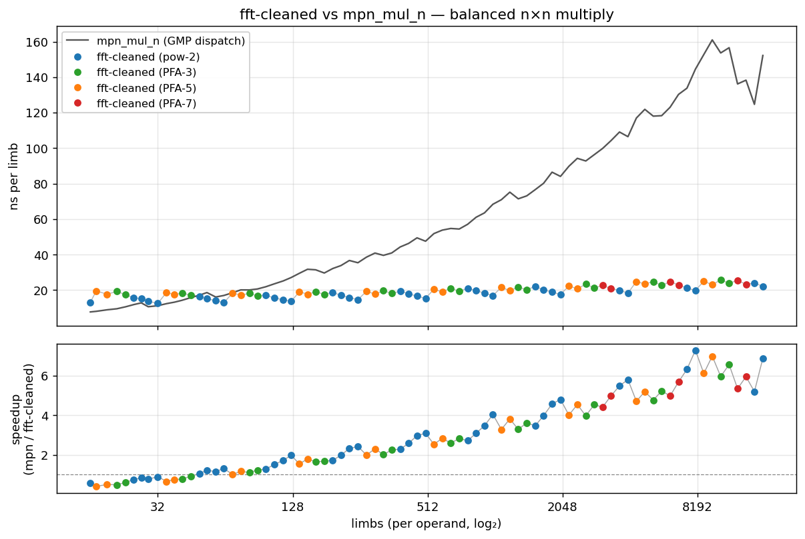

# int_fft

A compact, double-precision complex FFT multiplier for arbitrary-precision
integers. AVX2+FMA required. Single file, single translation unit, no
dependencies beyond the C++17 standard library.

- `fft::mul(rp, ap, an, bp, bn)` — `rp = ap * bp` for 64-bit-limb bigints.
- `fft::sqr(rp, ap, an)` — `rp = ap^2`.
- Cross-validates bit-exact against GMP's `mpn_mul_n` for all supported sizes.
- **~7× faster than GMP's dispatched multiplier** (Karatsuba/Toom/FFT) near
  the FFT sweet spot (~8000 limbs) on Zen4.

## Quick start

The library ships in two forms — pick whichever is easier to vendor.

### Single-header (STB style)

Drop `fft.hpp` into your project. In **exactly one** TU:

```cpp
#define INT_FFT_IMPLEMENTATION
#include "fft.hpp"
```

In other TUs:

```cpp
#include "fft.hpp"   // declarations only

std::uint64_t a[2] = {0x1234, 0}, b[2] = {0x5678, 0}, r[4] = {};
fft::mul(r, a, 2, b, 2);
```

Compile with:

```
clang++ -O3 -mavx2 -mfma -std=c++17 your_app.cpp -o your_app
```

### Split header + impl

```
src/fft.hpp   — public API declarations
src/fft.cpp   — the implementation
src/winograd_constants.h  — precomputed PFA butterfly constants
src/winograd_constants.py — generator + symbolic validation
```

```
clang++ -O3 -mavx2 -mfma -std=c++17 your_app.cpp src/fft.cpp -o your_app
```

## Compiler note — clang strongly preferred

All benchmark numbers below are clang-21 `-O3 -mavx2 -mfma`. gcc-11 produces
correct code but runs **~8–14% slower** across the board, with the biggest
gap on the PFA-5/7 templated butterflies (clang schedules the FMA chains
tighter and spills less across the 9 complex×real mults of the radix-7
Winograd form). If you care about perf, use clang.

## Inputs, outputs, limits

- Operands are arrays of `std::uint64_t` limbs, little-endian, no sign.
- Internally each 64-bit limb is split into 4 base-2^16 digits; the FFT
  combines evens and odds into one complex point via Bernstein's PQ
  right-angle trick, halving transform size.
- **Max supported size: 16384 limbs per operand** (65536-point complex FFT).
  Sizes beyond that return 0 from `fft::mul`.

## Algorithm

```
fft::mul(a, b):
    pick N_full = smallest FFT size ≥ needed digits
    forward FFT of a, b  (natural-order input, bit-reversed output)
    pointwise PQ multiply in bit-reversed order
    inverse FFT          (bit-reversed input, natural-order output)
    recover limbs from the real outputs
```

### Size grid: `N = M · 2^L` for `M ∈ {1, 3, 5, 7}`

A pure pow-2 FFT doubles the transform size at every octave boundary. If you
need 5120 complex points and the next pow-2 is 8192, you pay for ~60% extra
work you don't use.

int_fft extends the supported sizes with a prime-factor (Good-Thomas)
algorithm: after a radix-M prefix stage, each of the M branches runs a pure
pow-2 FFT of size `N/M`. This fills the size grid:

| M | cells between 2^{k-1} and 2^k |
|---|---|
| 1 (pow-2 only) | 0 |
| + 3 | 1 (3·2^{k-2}) |
| + 5 | 2 (5·2^{k-3}, 3·2^{k-2}) |
| + 7 | 3 (5·2^{k-3}, 3·2^{k-2}, 7·2^{k-3}) |

The picker (`choose_fft_size`) enumerates all four M values and picks the
smallest `N_full ≥ needed`. This is also why ns/limb stays flat across the
whole size range rather than doubling at each octave.

### Radix-M prefix stages

- **Radix-3** — Rader-Brenner form, 3 complex×real mults + 6 adds per butterfly.
- **Radix-5** — Winograd, 5 complex×real mults + 17 adds per butterfly.
- **Radix-7** — direct form, 18 complex×real mults (9 FMA chains) + ~32 adds.

Each prefix butterfly is followed by a generic `blend4(a, b, c, d)` lane-
shuffle (3 blend_pd per re/im = 6 blend ops total) and a rotating-pointer
trick: M stripe offsets live in one `__m256i` (8×u32), advanced by one
`vpaddd` per iter and cyclically rotated by one `vpermd` with an M-specific
static index. No per-iteration branching in the input reader.

A Winograd-7 (8 non-trivial mults) was prototyped and validated symbolically
via mpmath (`winograd_constants.py`), but runs ~5% **slower** than the
direct form on Zen4 — its extra adds contend with FMAs for the same 2 FP
ports, and FMA makes the mul-count savings moot. The direct form wins on
modern SIMD.

**PFA-7 threshold.** PFA-7's butterfly is ~5–7% slower per-limb than
pow-2 / PFA-3/5 (18 cv·real mults). Below `n_branch = 2048` the size-grid
savings don't offset the butterfly cost — pow-2 wins in total wall-clock.
`choose_fft_size` gates PFA-7 until `n_branch ≥ 2048` (≈ `n_limbs ≥ 3072`).

### Inner radix-2² cascade

Per branch, a standard decimation-in-frequency radix-2² cascade. Tiles of
4 complex points (8 doubles, 32 bytes, aligned) are the SIMD unit. The
final stage collapses into a tile-local 4-point DFT done in SSE pairs.

Precomputed twiddles are packed per stage in an AoSoV layout that matches
the tile access pattern (no per-iteration permutation).

### PQ right-angle convolution

Rather than zero-pad digits to hold full products, the forward FFT is done
on P = even-digit stream + i·(odd-digit stream), then the pointwise stage
decodes the symmetric pair `X[k], X[N/2-k]*` to recover the two independent
convolutions. This halves the transform size vs the naïve scheme.

The pointwise formula:

```
pq = X · Y                          (the usual complex product)
dp = X − Xn^                        (^ flips imag sign)
dq = Y − Yn^
c  = (dp · dq) · w                  (w: precomputed PQ twiddle)
z  = (pq − c/4) · scale
```

One helper (`pq_eval4_pair`) computes both halves of the antipodal pair at
once with shared cross-term — the partner side just uses conj(w), which is
free under the pq_omega_br bit-reversed construction.

### Limb recovery

After the inverse FFT, each tile holds 4 pairs of (even_digit, odd_digit)
in `double` form. Clip negatives, round to i64 via the 2^52 magic, merge
even + (odd << 16), and propagate the carry chain across two 64-bit halves
per tile using `__int128`. One tile per loop iter, no per-limb branches.

## Optimization log

The code is the result of a series of incremental optimizations — each with
measurable wall-clock impact and preserved bit-exact correctness via
`mpn_mul_n` cross-check at every step.

1. Radix-2² DIF/DIT cascade, AoSoV tile packing.
2. Tile-pack twiddles to match the tile access stride.
3. Final radix-2² tile done in SSE pairs (fewer lane crossings).
4. Cache-blocked cascade (256 or 512 tiles/block depending on lg(n) parity).
5. PQ right-angle convolution (halves transform size).
6. Paired pointwise eval (shared cross-term between antipodal partners).
7. Radix-3 PFA extension with rotating-offset invariant.
8. Radix-5 (Winograd) + radix-7 (direct form) PFA extensions.
9. Generic `blend4` shuffle + `__m256i`-held rotating offsets via `vpermd`.
10. Vectorized head of the pointwise scan (8 scalar iterations → 2 AVX2 ops).
11. PFA-7 threshold gate (`n_branch ≥ 2048`) to avoid its butterfly cost
    at small sizes where pow-2 wins anyway.

## Benchmarks

All numbers below: **Zen4, clang-21, `-O3 -mavx2 -mfma`**.

### Sweep: int_fft vs mpn_mul_n (GMP dispatch)

`bench/bench_sweep.cpp` sweeps 16..16384 limbs with 2^(1/8) spacing
(8 points/octave, 82 sizes), cross-checks every point against `mpn_mul_n`,
and writes CSV. `bench/plot_sweep.py` renders the result:



**Top panel** — ns/limb:

- **int_fft** holds flat at **~13–25 ns/limb** across the whole range. The
  visible small alternation between dots (colored by M ∈ {1, 3, 5, 7}) is
  the PFA size grid filling gaps between pow-2 octaves.
- **`mpn_mul_n`** climbs from ~8 ns/limb at 16 limbs (schoolbook) through
  Karatsuba / Toom-3/4/6h/8h transitions (visible as small bumps) to
  ~160 ns/limb at 8000+ limbs, then falls back toward ~125 ns/limb when
  GMP's own FFT kicks in past ~12000 limbs.

**Bottom panel** — speedup (mpn / int_fft):

| limbs | speedup |
|---|---|
| 32 | ~1.0× (crossover) |
| 256 | ~2× |
| 2048 | ~4× |
| 8000 | **~7× (peak)** |
| 16000 | ~5–6× (GMP's FFT engages) |

Below ~32 limbs, schoolbook / Karatsuba in GMP beats a full FFT, as
expected. `fft::mul` doesn't refuse these sizes — it just isn't the right
tool for them. Dispatch from your own code accordingly.

### Reproducing the benchmark

```
# Build (single-header variant):
clang++ -O3 -mavx2 -mfma -std=c++17 -DINT_FFT_SINGLE_HEADER \
        -I.. bench/bench_sweep.cpp -lgmp -lm -o bench_sweep

# Sweep 16..16384 limbs, 8 points/octave, 50 ms/point, median-of-5:
./bench_sweep --min 16 --max 16384 --factor 1.0905077 \
              --seconds 0.05 --warmups 2 --repeats 5 --csv sweep.csv

# Plot (requires Python + matplotlib):
python bench/plot_sweep.py sweep.csv -o sweep.png
```

The bench also cross-checks every size against `mpn_mul_n` before timing
and refuses to continue on mismatch.

## Numerical precision

- PFA butterfly constants are generated at 50-digit mpmath precision and
  rounded to the shortest decimal that round-trips IEEE-754 double
  (17 significant digits). `winograd_constants.py` also cross-validates
  each factorization against a direct DFT and reports max absolute error
  (currently ~10⁻⁵⁰, mpmath's internal ε).
- The FFT is a direct double-precision transform — no integer-NTT prime
  hairshirt. At 16384 limbs (65536-point FFT), digits are recovered to
  full 16-bit precision and cross-check bit-exact against
  `mpn_mul_n` across all tested inputs.
- The ~16384-limb limit is set by the point at which double-precision
  round-off approaches the per-digit integer threshold. Beyond that,
  you'd want split-precision or NTT backends (not provided here).

## Layout

```
int_fft/
├── fft.hpp                  ← single-header amalgamation (STB style)
├── LICENSE                  ← MIT
├── README.md
├── src/                     ← split header + impl variant
│   ├── fft.hpp
│   ├── fft.cpp
│   ├── winograd_constants.h
│   └── winograd_constants.py
└── bench/
    ├── bench_sweep.cpp      ← cross-check + timing, CSV output
    ├── plot_sweep.py        ← matplotlib CSV → PNG
    ├── sweep.csv            ← reference data (Zen4, clang-21)
    └── sweep.png
```

## License

MIT. See [LICENSE](LICENSE).
